# On the Fairness of Feature Attribution Explanations

This repository contains the code needed to reproduce the core experiments for
the paper: **On the Fairness of Feature Attribution Explanations.** It includes
FairLab black-box training, FastSHAP/LIME/Integrated Gradients/KernelSHAP
explanations, and explanation-quality metrics with sensitive-group gaps.

The public protocol uses a fixed sensitive-group-stratified **test subset**. The
original FairLab data loader may still expect files named `*_val.csv`; in this
repository that split is treated and reported as the test split.

## Repository Structure

```text
.
├── conimg/
│   └── icde_experiments.yaml
├── img/
│   ├── Compas_test_exploratory_summary_grid.png
│   ├── MEPS_test_exploratory_summary_grid.png
│   ├── Income_test_exploratory_summary_grid.png
│   ├── Income_3_test_exploratory_summary_grid.png
│   └── Education_test_exploratory_summary_grid.png
├── src/
│   ├── main.py                         # FairLab training CLI
│   ├── export_black_box_predictions.py # test logits/probabilities cache
│   ├── train_fastshap.py               # FastSHAP surrogate + explainer training
│   ├── create_test_subsets.py          # stratified fixed test subsets
│   ├── compute_explanations.py         # FastSHAP/LIME/IntGrad/KernelSHAP
│   ├── compute_xai_metrics.py          # quality means and gaps
│   ├── architectures/, dataloaders/, metrics/, runs/, wrappers/
│   └── fastshap/                       # tabular FastSHAP implementation
├── pyproject.toml
└── README.md
```

Plotting scripts, logs, generated results, checkpoints, and exploratory
mitigation code are intentionally excluded.

## Installation

```bash
python -m venv .venv
source .venv/bin/activate
python -m pip install --upgrade pip
python -m pip install -e .
```

FairLab uses Weights & Biases logging. For local offline runs:

```bash
export WANDB_MODE=offline
```

## Expected Data Layout

Place processed CSV files under a data root such as:

```text
data/
└── <experiment_name>/
    └── node_1/
        ├── <dataset>_train.csv
        └── <dataset>_val.csv   # used as the paper test split
```

You can also pass explicit `--train-set` and `--test-set` paths to the export
script.

## 1. Train FairLab Black Boxes

Example for Group-DP on Income:

```bash
fairlab-train \
  --run income_fairlab \
  --project_name Group-DP-Income \
  --root_dir data \
  --start_index 1 \
  -ml demographic_parity \
  -gl Race \
  -tl 0.10 \
  --num_classes 2
```

For equalized odds, use:

```bash
-ml equalized_odds
```

For multiclass datasets (`income_3_fairlab`, `education_fairlab`), pass
`--num_classes 3`.

## 2. Export Black-Box Test Predictions

Each trained black box must be exported into the experiment directory expected
by the explanation scripts:

```bash
fairxai-export-bb \
  --run income_fairlab \
  --checkpoint checkpoints/path/to/model.h5 \
  --output-dir results/Tau_010/Income/Race \
  --sensitive-attribute Race \
  --root-dir data \
  --experiment-name group_fairness \
  --start-index 1
```

This writes:

```text
black_box.h5
black_box_logits_and_data.npz
```

The cache includes `X_train`, test `X`, black-box logits/probabilities,
black-box predicted labels, true labels, sensitive-group IDs, feature names, and
categorical-feature masks.

## 3. Train FastSHAP

FastSHAP is the only explainer here that requires training.

```bash
fairxai-train-fastshap \
  --experiment-dir results/Tau_010/Income/Race \
  --device cpu
```

Default FastSHAP settings:

```text
surrogate: mlp2hidden_surrogate, hidden=(512, 128), epochs=200, lr=1e-4
explainer: mlp2hidden_explainer, hidden=(256, 128), epochs=300, lr=1e-4
coalition samples per explainer batch: 128
```

The script writes:

```text
surrogate_model.h5
explainer_model.h5
fastshap_explanations.npz
```

## 4. Create Fixed Test Subsets

The main experimental protocol uses a fixed test subset, stratified by the
sensitive groups of each dataset/attribute pair:

```bash
fairxai-create-test-subsets \
  --root results/New_Experiments \
  --n-records 2000 \
  --min-per-group 20 \
  --seed 42
```

Subsets are saved under:

```text
results/New_Experiments/test_subsets/
```

## 5. Compute Explainer Attributions

```bash
fairxai-compute-explanations \
  --root results/New_Experiments \
  --n-records 2000 \
  --min-per-group 20 \
  --seed 42 \
  --explainers fastshap intgrad lime kernelshap
```

Default explainer settings:

```text
FastSHAP: uses saved fastshap_explanations.npz and subsets it.
IntGrad: shap.GradientExplainer, background size 256, batch size 64.
LIME: LimeTabularExplainer, categorical features from cat_cols_mask,
      num_samples=1000, discretize_continuous=True.
KernelSHAP: shap.KernelExplainer, kmeans background size 100,
            nsamples=200, batch size 16.
```

Attribution files are written beside each experiment:

```text
test_subset_n2000_min20_seed42_<explainer>_explanations.npz
```

## 6. Compute Explanation Quality and Gaps

```bash
fairxai-compute-metrics \
  --root results/New_Experiments \
  --n-records 2000 \
  --min-per-group 20 \
  --seed 42 \
  --explainers fastshap intgrad lime kernelshap
```

The output CSV reports:

```text
quality_mean, quality_std, quality_n_eval, gap
```

The `gap` column is the paper gap:

1. Compute per-record metric scores using a within-group reference.
2. Split each sensitive group by the black-box predicted class.
3. For each predicted class, compute the maximum pairwise group difference.
4. Average these class-wise gaps.

Metric defaults:

```text
Sufficiency: Quantus Sufficiency, threshold=0.6, distance_func=seuclidean,
             normalise=True, abs=False.
Consistency: Quantus Consistency, top_n_sign with n=5, normalise=True.
Stability: rank agreement in cosine-similarity neighborhoods, k=5 and k=10,
           signed feature ranking, standardized input features.
```

Outputs are stored under:

```text
results/New_Experiments/xai_metrics/test_subset_n2000_min20_seed42/
```

## Supported Runs

```text
compas_fairlab    -> Compas, binary
mep_fairlab       -> MEPS, binary
income_fairlab    -> Income, binary
income_3_fairlab  -> Income_3, multiclass
education_fairlab -> Education, multiclass
```

# Main results

This section summarizes the empirical findings of the paper. The experiments compare fairness-aware black-box predictors trained with different fairness thresholds, \(\tau \in \{0.10, 0.20, 0.30, 0.40, 1.00\}\), and evaluate whether the fairness achieved at prediction level is reflected in post-hoc feature attribution explanations. Overall, the results show that prediction fairness and explanation fairness are related, but they are not equivalent: fairer predictions often lead to fairer explanations only when fairness mitigation is effective, predictive uncertainty is limited, and the explanations have sufficiently high quality.

## Prediction Fairness Analysis
The FairLAB models provide a controlled family of predictors with different levels of predictive fairness. In the group fairness settings, both Group-DP and Group-EOD generally follow the requested fairness thresholds: stricter values of \(\tau\) reduce predictive disparities, while more relaxed values allow higher fairness violations and usually improve predictive performance. This confirms that group-level fairness can be effectively mitigated within the fixed performance budget used in the experiments.

The intersectional settings are more challenging. Although Int-DP and Int-EOD still reduce unfairness, the strictest thresholds are not always fully achieved, especially on the multiclass datasets. This indicates that the combination of multiple sensitive attributes and multiple prediction classes increases the difficulty of satisfying fairness constraints without exceeding the allowed performance degradation.

<p align="center">
  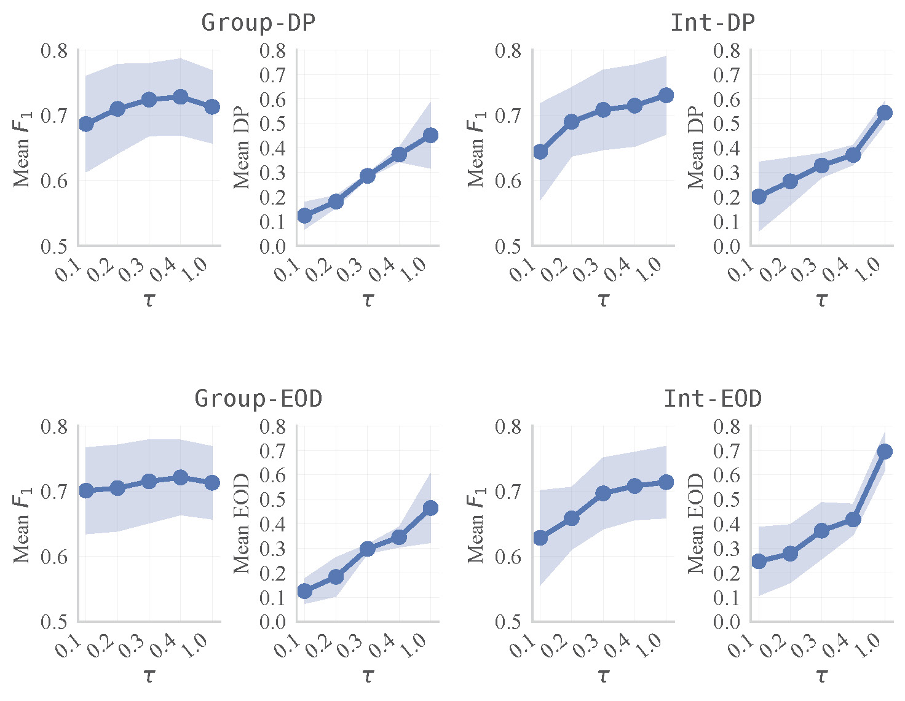
</p>

## Explanation Quality Analysis
The explanation-quality results show that the quality of feature attribution explanations depends both on the prediction task and on the fairness level of the underlying black-box model. Binary datasets generally obtain higher Sufficiency, Consistency, and Stability scores than multiclass datasets, suggesting that producing faithful and robust explanations becomes harder as the prediction task becomes more complex.

Across fairness thresholds, Sufficiency is the metric that reacts most clearly to fairness mitigation. Stricter fairness requirements, corresponding to lower values of \(\tau\), are generally associated with higher Sufficiency. Consistency follows a similar but weaker trend, while Stability remains mostly stable or fluctuates without a clear monotonic behavior. Across explainers, FastSHAP, Integrated Gradients, and KernelSHAP tend to show comparable behavior, whereas LIME is more variable: it can achieve high Sufficiency in some configurations, but it is less stable across metrics and settings.

<p align="center">
  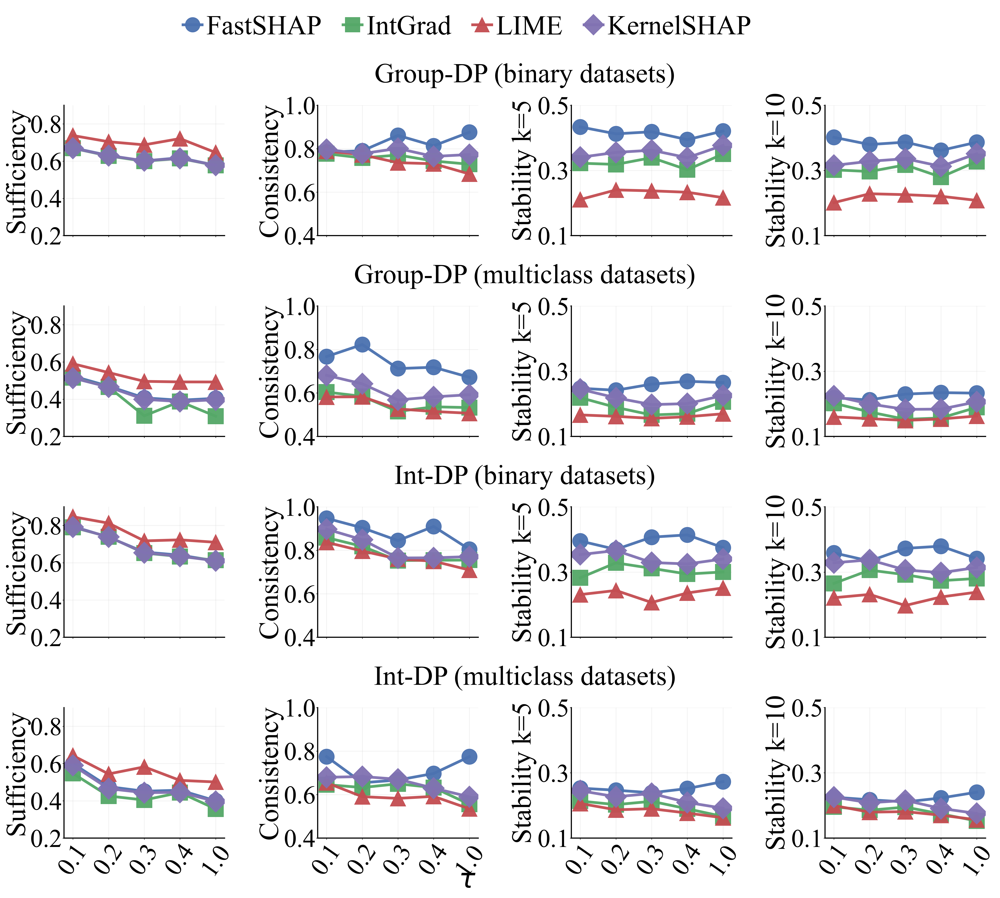
</p>

<p align="center">
  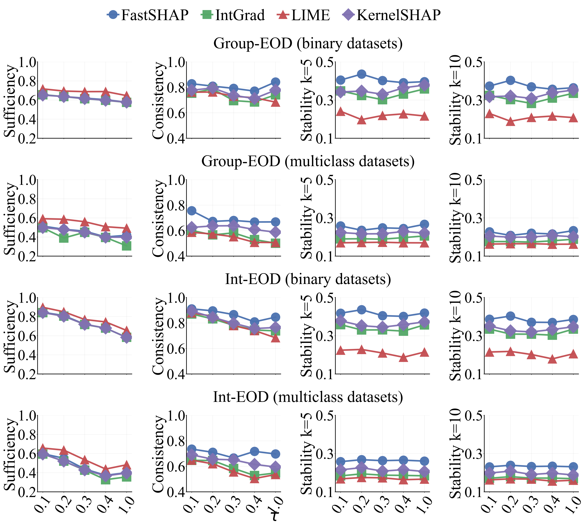
</p>

## Explanation Fairness Analysis
Explanation fairness is evaluated through class-wise disparities in explanation quality across sensitive groups. The Sufficiency gap provides the clearest signal. In the binary Group-DP setting, class-wise Sufficiency gaps are small under strict fairness constraints and increase as \(\tau\) is relaxed. This behavior is aligned with the predictive-fairness results: when the predictor is fairer, uncertainty is lower, and explanations have higher quality, the explanations also tend to be more balanced across groups.

The pattern becomes less regular in multiclass and intersectional settings. In these cases, class-wise gaps are larger and more variable across classes and explanation methods. This suggests that explanation fairness is harder to characterize when fairness mitigation is more difficult, subgroup-class combinations are sparse, predictive uncertainty is higher, and explanation quality deteriorates.

The correlation analysis confirms this picture. The Sufficiency gap shows a positive relationship with both DP and EOD, especially in binary settings; in Group-DP binary experiments, all explainers exhibit strong positive correlations. By contrast, Consistency and Stability gaps do not show a stable relationship with prediction fairness, and their correlations vary substantially across explainers and settings. Thus, Sufficiency is the most informative metric among those considered for connecting prediction fairness and explanation fairness.

<p align="center">
  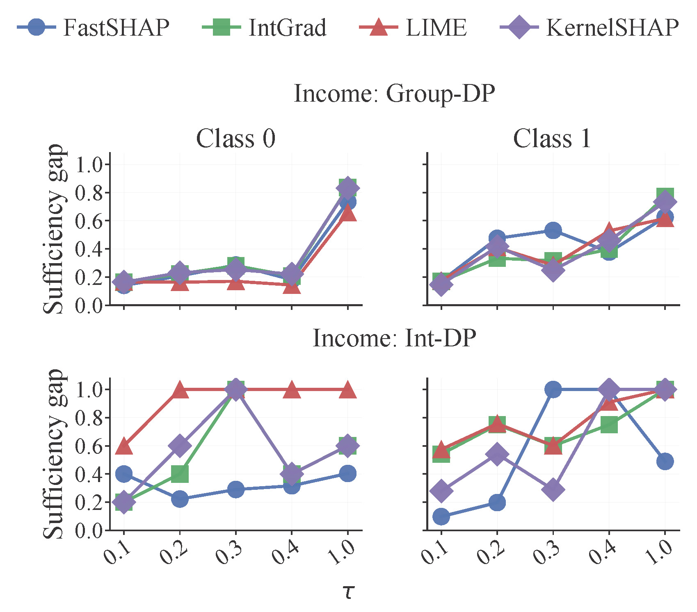
</p>
<p align="center">
  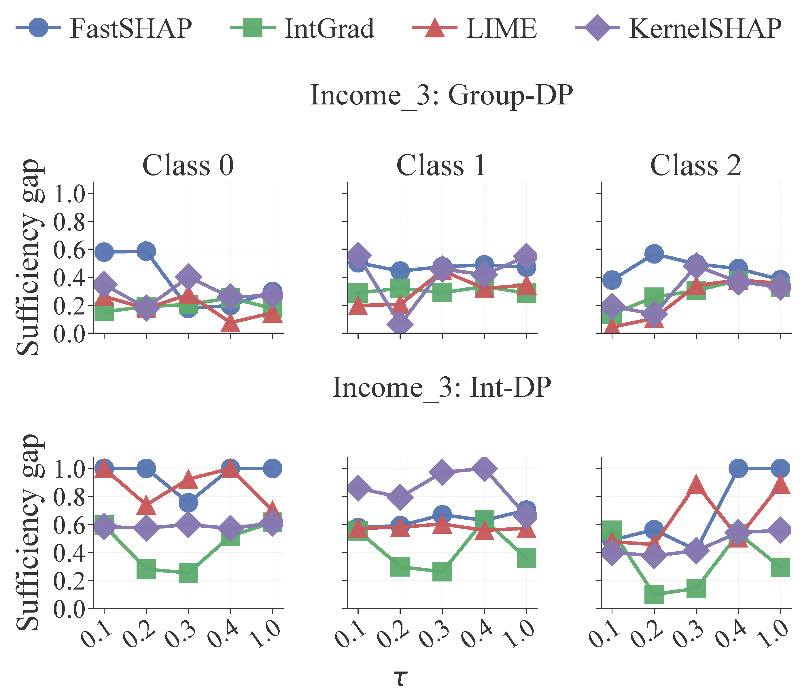
</p>

<p align="center">
  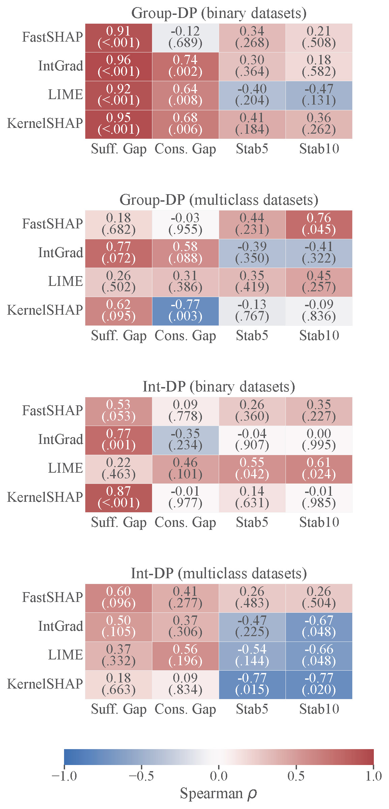
</p>
<p align="center">
  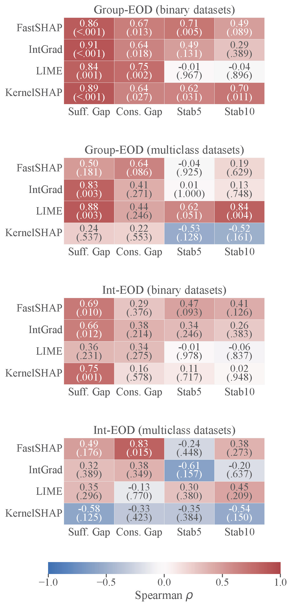
</p>

# Additional Information about the Experiments

## Data Description
Here, we report a descriptive analysis of the datasets used in our experiments. For each dataset, we summarize: (A) the target class distribution; (B) the smallest and largest sensitive groups, highlighting group-size imbalance; (C) the class composition within these extreme groups; (D) the most label-informative features, measured through normalized mutual information with the target variable; (E) the cumulative concentration of label information across ranked features; and (F) the strongest pairwise feature associations, measured through normalized mutual information. Together, these diagnostics provide insights into class imbalance, sensitive-group heterogeneity, feature relevance, and feature dependence structures that may influence both predictive performance and explanation fairness.

The datasets differ substantially in class balance, subgroup sparsity, and concentration of predictive information. Compas is the most balanced binary task, while Income and MEPS are more imbalanced. Income_3 is almost balanced across its three classes, whereas Education is a multiclass task with a dominant middle class. The intersectional setting introduces strong subgroup-size imbalance, especially for Income, where the smallest intersectional subgroup contains only a few instances. This sparsity is important for the fairness analysis because subgroup-level estimates can become more sensitive to small changes in the predictor.

The datasets also differ in how concentrated the label information is. Income has the most concentrated signal, with a small set of features explaining most of the mutual information with the target. Compas and Income_3 show a similar, although slightly less concentrated, structure. Education distributes the information across more features, while MEPS is the least concentrated dataset. These differences help explain why explanation quality and explanation fairness are not uniform across datasets: when the task is more complex or the informative signal is more diffuse, producing stable and faithful feature attributions becomes harder.

### Compas
The dataset contains 6,172 criminal records from Broward County, Florida, with 34 features describing demographics, criminal history, and incarceration details. The goal is to predict whether a defendant will re-offend within two years.  
<p align="center">
  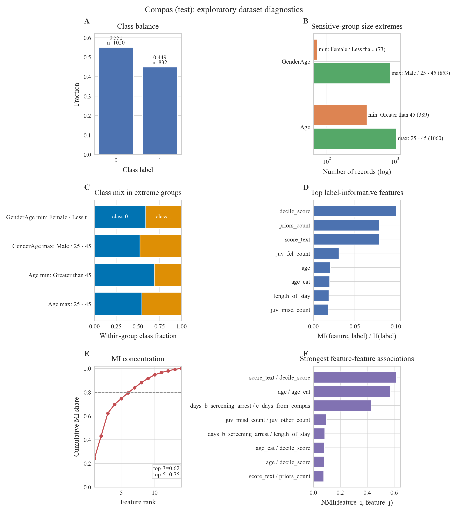
</p>

### MEPS
Derived from the 2015 Medical Expenditure Panel Survey, it includes about 30,000 records and 132 features after preprocessing. The task is to predict whether an individual’s annual medical expenditures exceed the third quartile.  
<p align="center">
  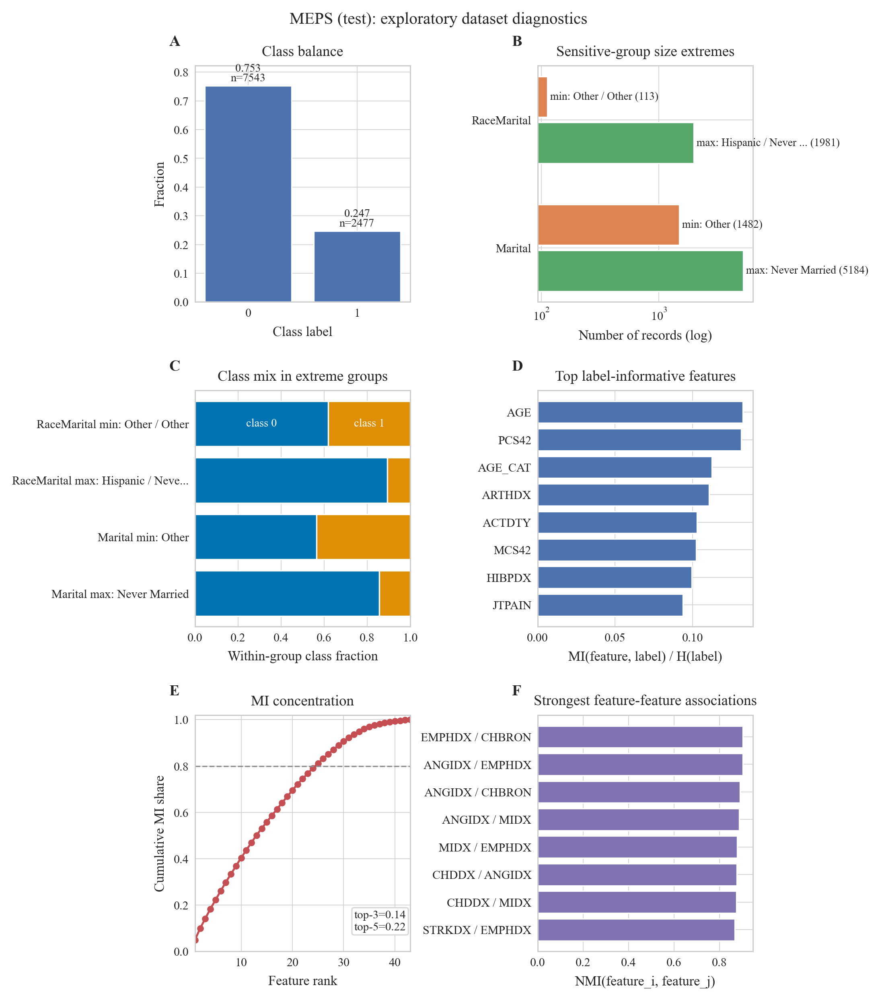
</p>

### Income
Drawn from the Folktables suite, based on the 2014 U.S. Census, it contains approximately 2.45 million records and 20 features after preprocessing. The task is to predict whether an individual earns more than \$50,000 annually.  
<p align="center">
  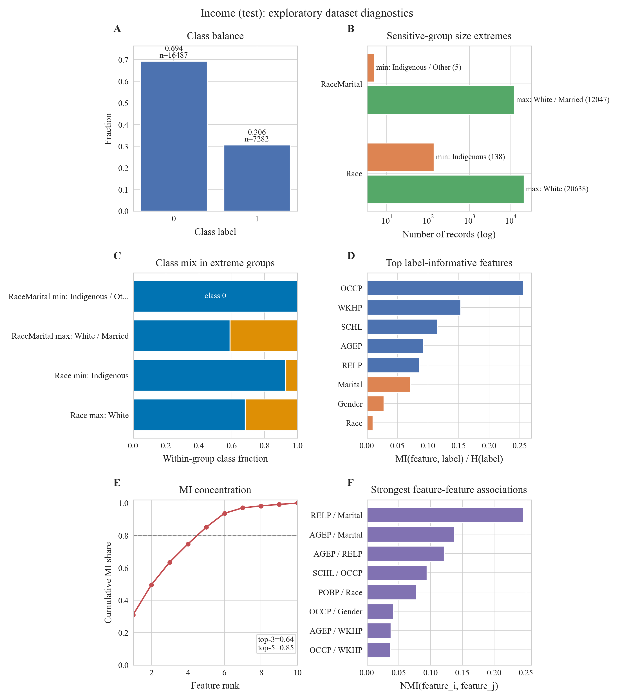
</p>

### Income_3
This dataset extends Income to multiclass classification, using the same 20 features and 2.45 million records but with three income brackets as labels: below \$30,000, between \$30,000 and \$50,000, and above \$50,000. 
<p align="center">
  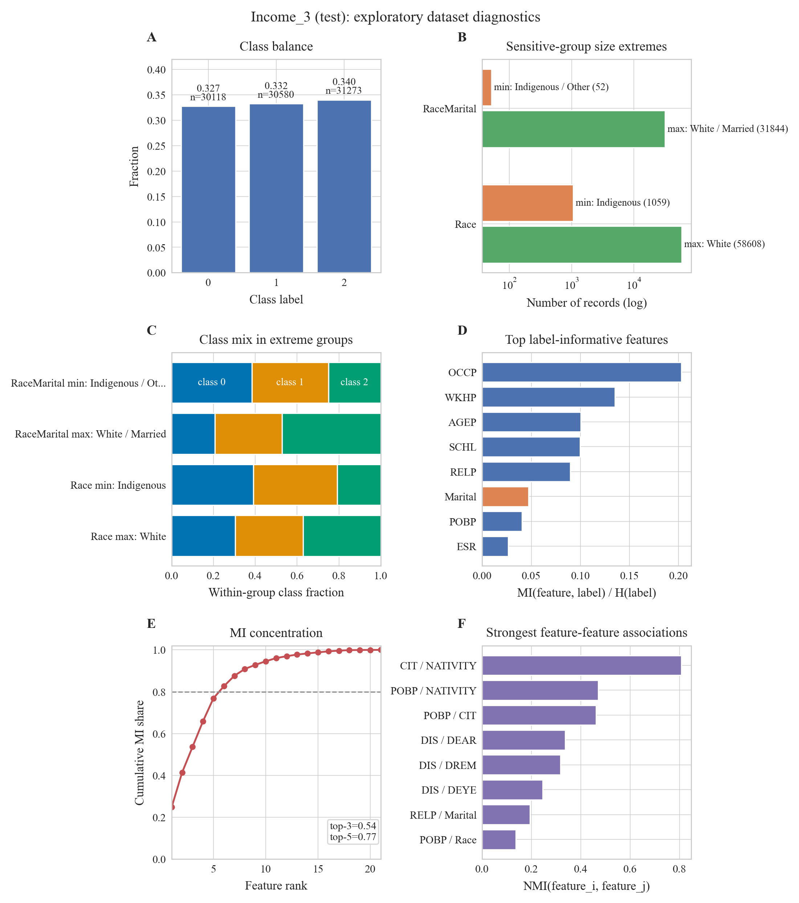
</p>

### Education
Derived from Folktables, it contains about 2.45 million records and 25 features after preprocessing. The task is multiclass classification: predicting education level with three classes (less than high school, high school, and college or above).

<p align="center">
  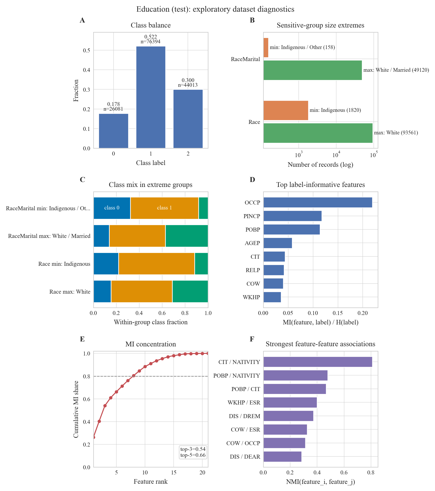
</p>

## Black-box Predictive Model

Across all datasets, the predictive model is implemented as a feedforward neural network with two hidden layers containing $300$ and $100$ neurons, respectively, and ReLU activation functions. A Dropout layer with rate $0.2$ is applied after the last hidden layer for regularization, while the output layer uses the Softmax function. The neural network is trained for a maximum of 30 iterations at the orchestrator level and up to 10 epochs per learner. Early stopping is employed with a patience of 5 epochs at
both levels, based on the scoring functions.
At the learner level, optimization is performed using the Adam optimizer with a learning rate of 1e−4, weight decay of 1e−4, and batch size 128. The training loss is the Cross-Entropy loss.

## Prediction Fairness Analysis
The following plots provide a detailed view of the predictive behavior of the FairLAB models for the four experimental configurations. They complement the aggregate results by showing how performance and fairness evolve for each dataset as the fairness threshold \(\tau\) changes.

For Group-DP and Group-EOD, the behavior is generally consistent with the requested thresholds: stricter constraints reduce fairness violations, while more relaxed thresholds allow better predictive performance. This confirms that, at group level, FairLAB is usually able to find predictors that satisfy the fairness requirements within the fixed performance budget. For Int-DP and Int-EOD, mitigation remains visible but is less regular. The strictest thresholds are harder to satisfy, mainly because intersectional groups are more numerous and sometimes sparse, and the difficulty increases further on multiclass datasets such as Income_3 and Education.

The detailed plots should therefore be read as the predictive baseline for the explanation analysis. They show that the following explanation results are not obtained from arbitrarily degraded predictors: even when intersectional constraints are difficult to satisfy exactly, the models preserve competitive predictive performance under the imposed budget.

### Group-DP
<p align="center">
  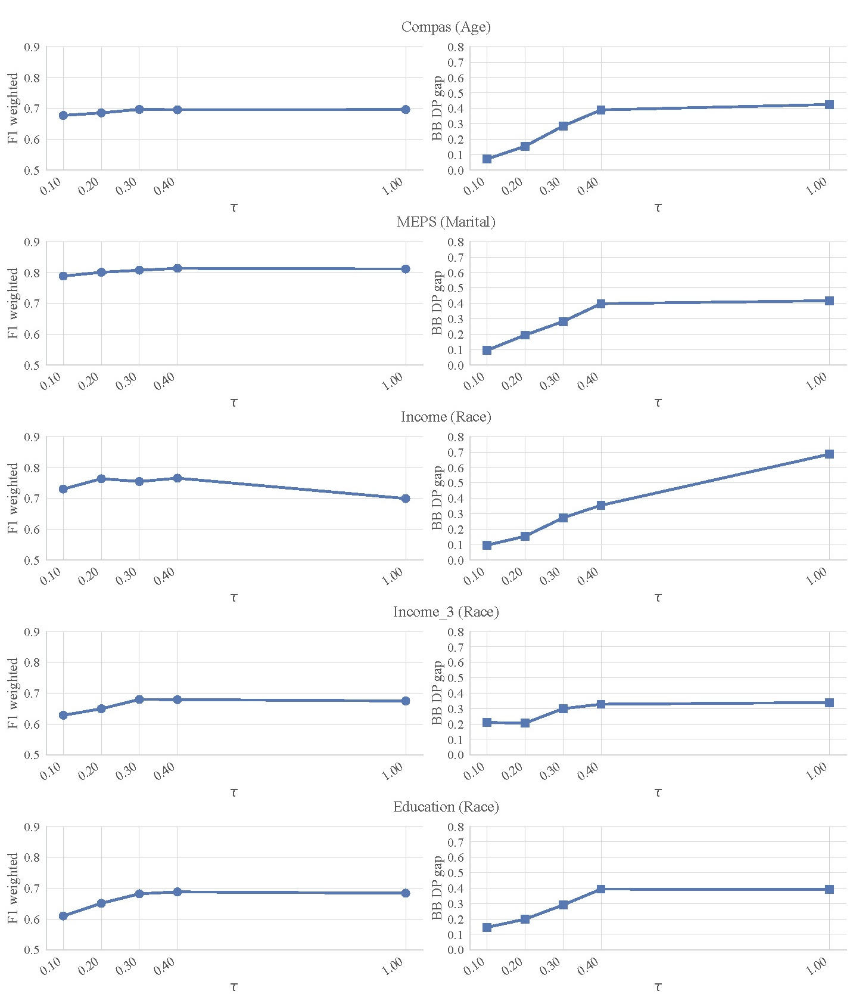
</p>

### Group-EOD
<p align="center">
  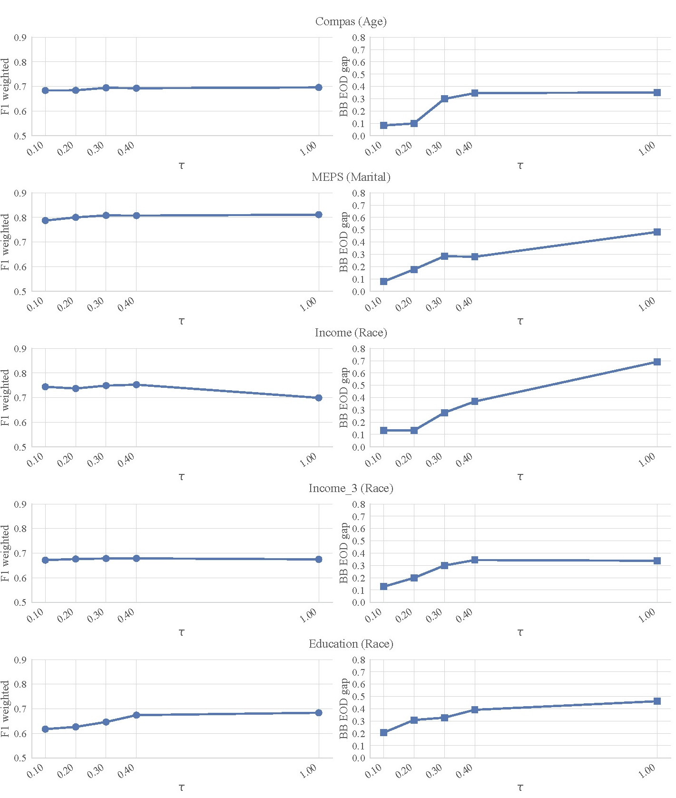
</p>

### Int-DP
<p align="center">
  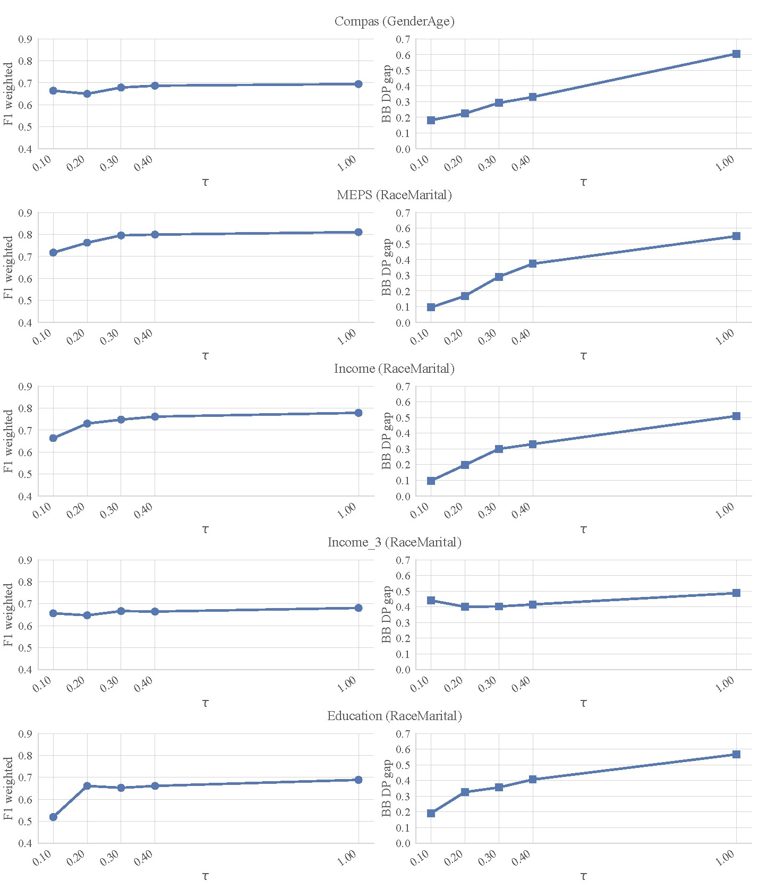
</p>

### Int-EOD
<p align="center">
  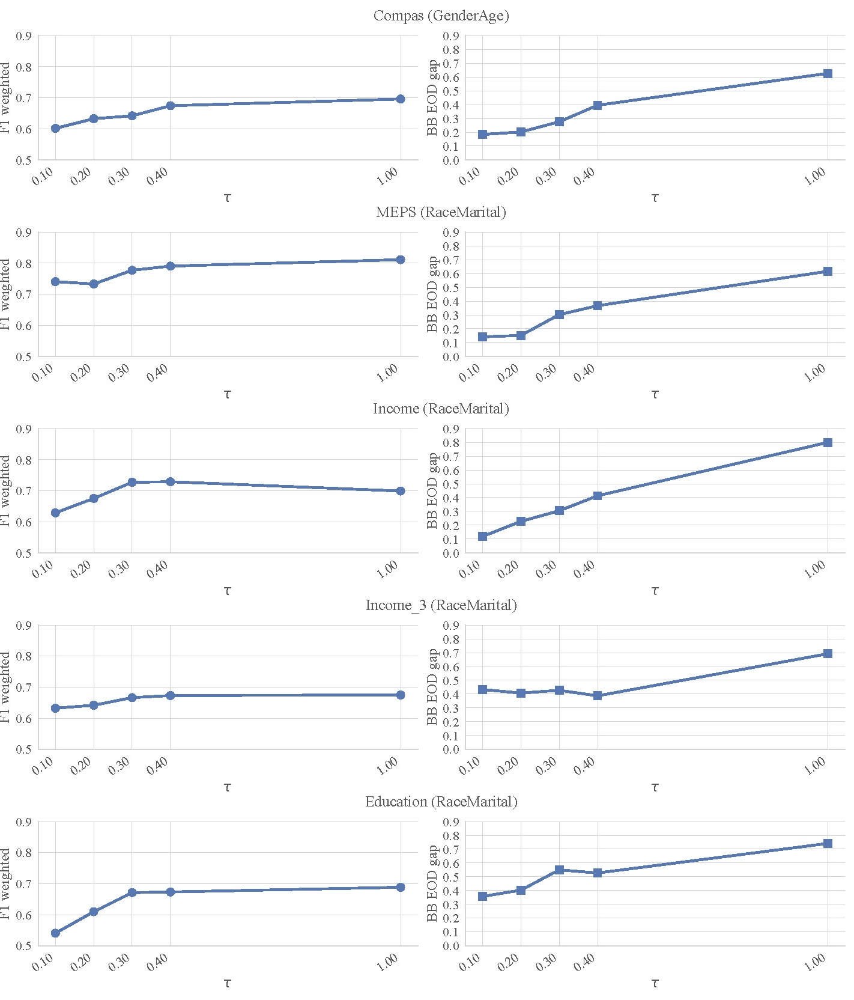
</p>

## Explanation Quality Analysis

In addition to the quality metrics reported in the main results, we analyze whether fairness mitigation changes the explanatory factors selected by the attribution methods. For this purpose, we compare the top-3 features identified by each explainer with the top-3 label-informative features computed through mutual information on the original input data.

The Jaccard overlap results for Income and Income_3 under Group-DP show that the selected features vary across fairness thresholds, but without a clear monotonic trend as \(\tau\) becomes stricter or more relaxed. Differences across explanation methods are more pronounced than differences across fairness levels. This suggests that the choice of the explainer has a stronger effect on the selected feature-importance set than the fairness constraint imposed during training.

Importantly, agreement on the most relevant features is not sufficient to guarantee faithful explanations. Even when different configurations identify similar top-ranked features, their Sufficiency scores can differ substantially. In practice, two explanations may highlight similar features while differing in how well those features reconstruct the black-box prediction.

<p align="center">
  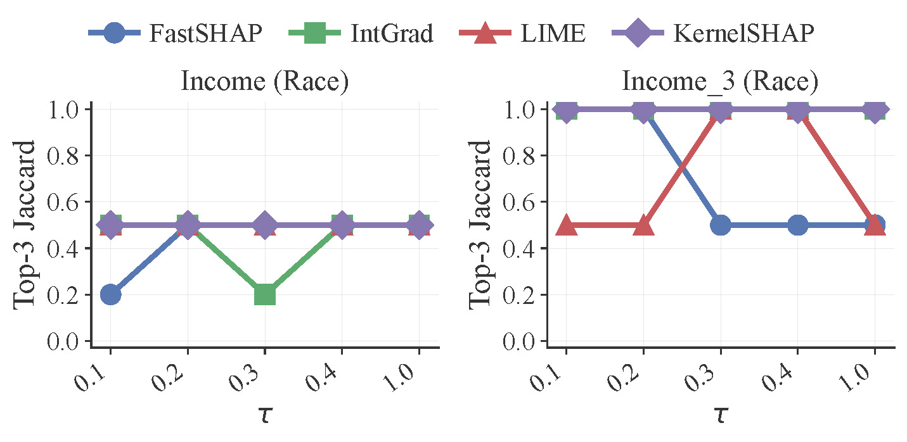
</p>

## Overall Takeaways

The experiments support three main conclusions. First, prediction fairness and explanation fairness are connected but distinct properties: fairer predictions can lead to fairer explanations, but this transfer is not automatic. Second, Sufficiency is the explanation-quality metric that most consistently reflects fairness-related behavior, while Consistency and Stability are less reliable for this purpose. Third, explanation fairness becomes harder to characterize in multiclass and intersectional settings, where fairness mitigation is more challenging, subgroup-class combinations are sparser, predictive uncertainty is higher, and explanation quality tends to decrease.

For this reason, fairness should be assessed across the whole predictive and explanatory pipeline, rather than inferred only from the predictive fairness of the black-box model.